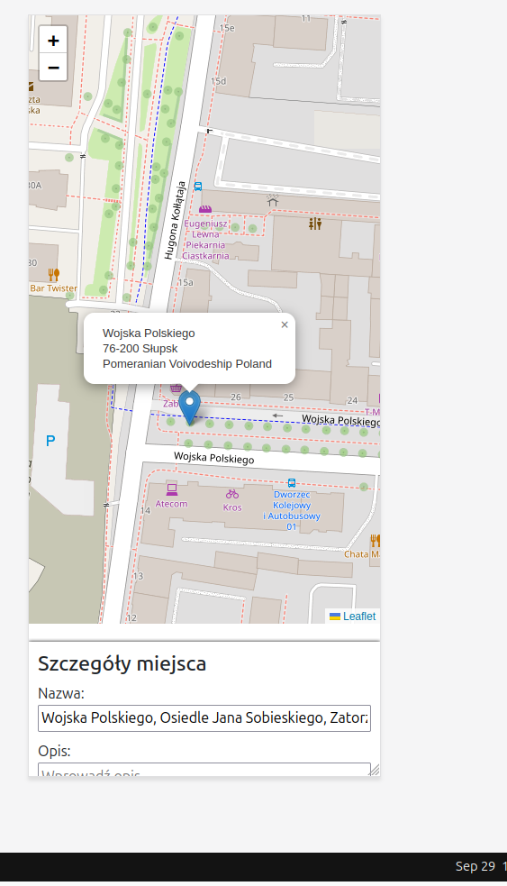
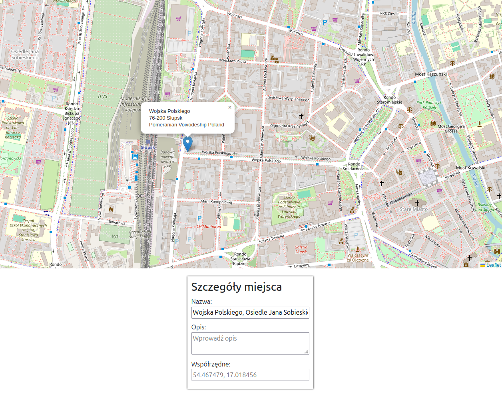

## To launch the app:
1. cd zad2.1
2. npm install
3. npm run dev

3.5 Kiedy użytkownik klika na mapie, to powinien odczekać sekundę, dwie
    aby dane się w pełni załadowały (przy słabszym połączeniu z siecią)

1. Podgląd na telefonie

2. Podgląd na desktopie

